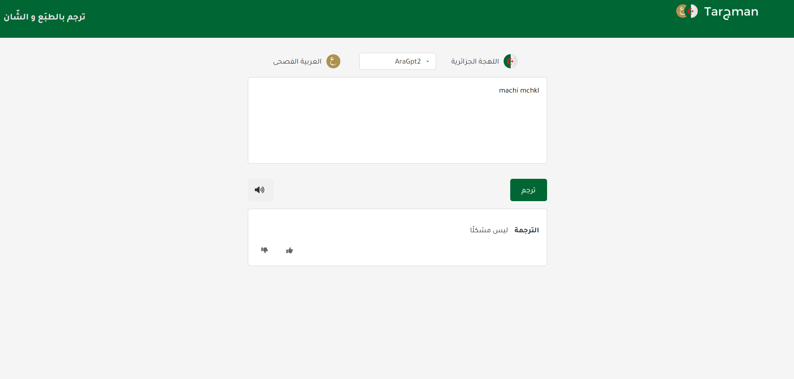

# Tarجman  - Arabic to Darija Translation -ترجم بالطبَع و الشّان-

**Tarجman** is a web application designed to translate Arabic sentences into Algerian Darija. It provides a simple and efficient way to interact with the translation model, where users can input Arabic sentences and receive the corresponding translation in Darija.

## Features
- Input an Arabic sentence and get its translation in Darija.
- Simple and user-friendly interface.
- Built using Flask, integrating machine learning models for translation.

## Requirements

Before running the application, make sure to set up the environment and install the necessary dependencies. You can install all required libraries from the `requirements.txt` file.

### Steps to Run the Flask Application

1. **Clone the repository:**
   ```bash
   git clone https://github.com/yourusername/tarjman.git
   cd tarjman
2. **Set up a virtual environment (optional but recommended):**
   - For Linux/Mac:
     ```bash
     python3 -m venv venv
     source venv/bin/activate
     ```
   - For Windows:
     ```bash
     python -m venv venv
     .\venv\Scripts\activate
     ```

3. **Install the dependencies:**
   Make sure to install the required Python libraries by running the following command:
   ```bash
   pip install -r requirements.txt
   

